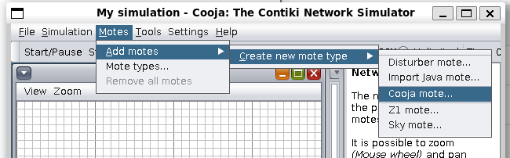

# Contiki-NG LEACH Protocol Simulation

This project demonstrates the implementation and simulation of the **LEACH protocol** in Contiki-NG using the Cooja simulator.

---

## 1. Install Contiki-NG

Clone the Contiki-NG repository:

```bash
git clone https://github.com/contiki-ng/contiki-ng
cd contiki-ng

2. Run Cooja
Navigate to the Cooja tool directory and run it:
cd ~/contiki-ng/tools/cooja
./gradlew run

3. Implement LEACH Protocol
cd ~/contiki-ng/examples/nullnet
Add the following files:
Makefile
leach.c
leach_edgegateway.c

For LEACH-C protocol, use leach_c.c and leach_c_edge_gateway.c.

```

```


4. Create a Simulation in Cooja
1. File → New simulation → Create
screenshots/2.png
2. Motes → Add motes → Create new mote type → Cooja mote
screenshots/3.png
3. Click Browse and navigate to:
examples/nullnet/leach.c
screenshots/4.png
4. Open, compile, and create the mote
screenshots/5.png
5. Choose the number of motes you want to create
screenshots/6.png

Repeat the same steps for leach_edge_gateway.c and create 1 gateway mote.

5. Run the Simulation
Press Start / Pause to start the simulation
Observe the network behavior under the LEACH protocol

Tips:
Ensure Java is installed for Cooja
Use leach_c.c and leach_c_edge_gateway.c for LEACH-C implementation
Adjust the number of motes to see how network performance scales

* Developed as part of the UCSC CSE257 Masters course.
