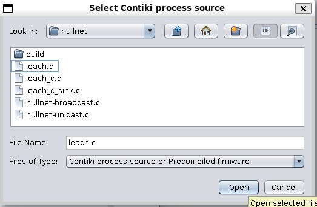
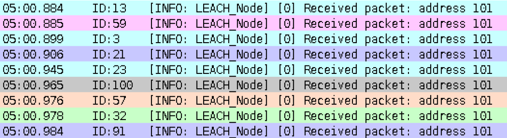
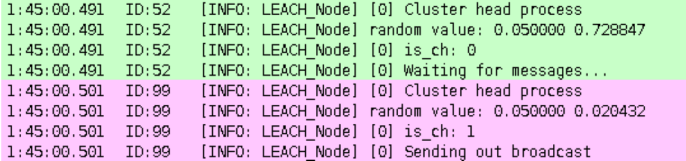
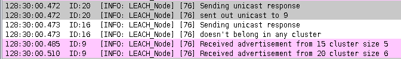
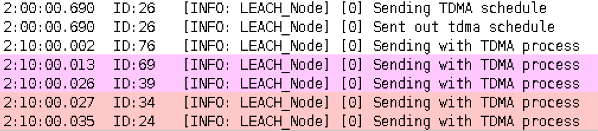
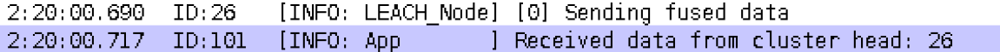
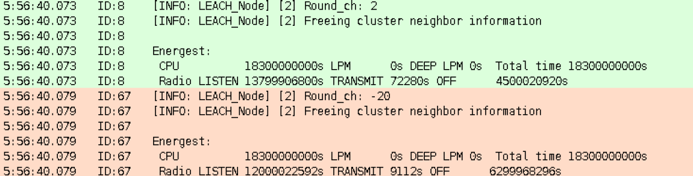

# Contiki-NG LEACH Protocol Simulation

This project demonstrates the implementation and simulation of the **LEACH protocol** in Contiki-NG using the Cooja simulator. 

---

# 1. Install Contiki-NG

Clone the Contiki-NG repository:

```bash
git clone https://github.com/contiki-ng/contiki-ng
cd contiki-ng
```

2. Run Cooja
Navigate to the Cooja tool directory and run it:
```bash
cd ~/contiki-ng/tools/cooja
./gradlew run
```

3. Implement LEACH Protocol
```bash
cd ~/contiki-ng/examples/nullnet
```
Add the following files:
- Makefile
- leach.c
- leach_edgegateway.c

For LEACH-C protocol, use leach_c.c and leach_c_edge_gateway.c.

4. Create a Simulation in Cooja
1. File → New simulation → Create

2. Motes → Add motes → Create new mote type → Cooja mote

3. Click 'Look In' and navigate to:
examples/nullnet/leach's


4. Press open, compile, and create the mote

5. Choose the number of motes you want to create

Repeat the same steps for leach_edge_gateway.c and create 1 gateway mote.

5. Run the Simulation
Press Start / Pause to start the simulation
Observe the network behavior under the LEACH protocol

Tips:
Ensure Java is installed for Cooja
Use leach_c.c and leach_c_edge_gateway.c for LEACH-C implementation
Adjust the number of motes to see how network performance scales

---
# LEACH Overall System Diagram


**Processes:**

1. Main process



2. CH selection process



3. CH advertisement process
4. Non CH advertisement process



5. TDMA schedule creation process
6. TDMA data transmission process



7. CH data fusion process



(8. Energy calculation process)



9. Free variable process


---
# References
- **LEACH**: W. R. Heinzelman, A. Chandrakasan and H. Balakrishnan, "Energy-efficient communication protocol for wireless microsensor networks," Proceedings of the 33rd Annual Hawaii International Conference on System Sciences, Maui, HI, USA, 2000, pp. 10 pp. vol.2-, doi: 10.1109/HICSS.2000.926982. keywords: {Energy efficiency;Wireless application protocol;Wireless communication;Microsensors;Energy dissipation;Routing protocols;Telecommunication network reliability;Monitoring;Spread spectrum communication;Scalability},
- **LEACH-C**: W. B. Heinzelman, A. P. Chandrakasan and H. Balakrishnan, "An application-specific protocol architecture for wireless microsensor networks," in IEEE Transactions on Wireless Communications, vol. 1, no. 4, pp. 660-670, Oct. 2002, doi: 10.1109/TWC.2002.804190.
keywords: {Wireless application protocol;Microsensors;Energy efficiency;Delay;Signal processing algorithms;Remote monitoring;Intelligent networks;Robustness;Wireless communication;Access protocols},

* Developed as part of the UCSC CSE257 Masters course.
